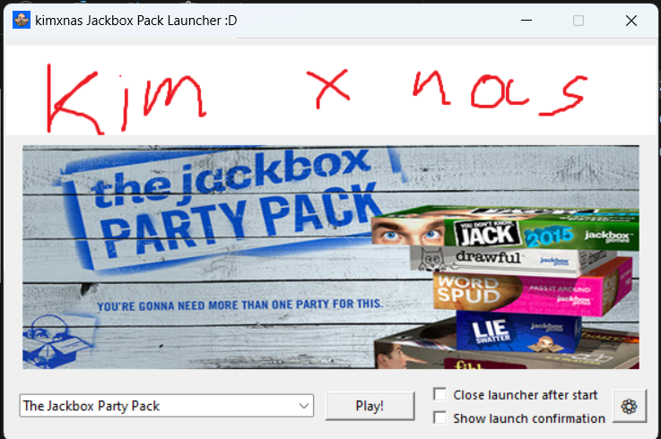

# Jackbox Party Pack Launcher

A clean, no-frills launcher for all 10 Jackbox Party Packs. Pick a pack, hit Play — that's it.



## Download

Head to [**Releases**](https://github.com/kimxnas/Jackbox-Partypack-Launcher/releases) and grab the latest `JackboxPartypackLauncher.exe`. No install, no dependencies — just run it.

> ⚠️ Windows may show a "SmartScreen" warning since the exe isn't code-signed.
> Click **More info → Run anyway**. The source is open if you want to inspect it.

## Features

- **🎲 Find a Game** — slide-out panel that recommends specific Jackbox games based on player count and style (Trivia, Drawing, Comedy, Bluffing, Social, Music). List all matches or let it randomly pick one
- **Recently played** — your last 3 launched packs as quick-launch chips
- **Last-played indicator** — see when you last played each pack at a glance
- **🎮 Steam auto-detect** — read your Steam library and auto-import installed Jackbox packs in one click
- **Folder auto-detect** — alternative method: point at any folder and find Jackbox exes recursively
- **Pack info** — click ⓘ next to the dropdown to see what games are in the selected pack with player counts and tags
- **Pack stats** — see your most-played packs ranked in settings
- **Custom banners** — swap in your own header image (classic UI)
- **Classic & Modern UI** — toggle between the original look and a sleek dark Jackbox-themed theme. **Both UIs now have proper tabbed settings**
- **Game cover art** — smoothly rounded box art (preloaded in the background for instant switching)
- **Tabbed settings** — General / Game Paths / About — clean and discoverable
- **Visibility toggles** — hide Recently Played or the Find a Game button if you prefer a minimal view
- **Check for updates** — one click in settings checks GitHub for a newer release
- **Backup & restore** — export/import `launcher_settings.json` to move setups between PCs
- **Start with Windows** — optional autostart toggle
- **Settings persist** — your paths and preferences live in `%APPDATA%\JackboxLauncher`
- **Safe by default** — exe paths validated, banners size-checked, subprocesses spawned with `shell=False`

## How to use

1. Download `JackboxPartypackLauncher.exe` from [Releases](https://github.com/kimxnas/Jackbox-Partypack-Launcher/releases)
2. Run it — no install needed
3. Click **⚙** → **Game Paths** → **🎮 Detect from Steam** (or auto-detect from a folder)
4. (Optional) Switch to the modern UI and try **🎲 Find a Game** to get suggestions
5. Select a pack from the dropdown and hit **Play!**

## Planned

- **Direct game launch** — boot straight into a specific game inside a pack (research notes in `docs/direct-game-launch.md`)
- **Inno Setup installer** — proper Windows installer for instant startup (no extraction each launch)
- **Discord Rich Presence** — show what pack you're playing on Discord status
- **System tray mode** — close to tray, click tray icon to bring back
- **CLI flags** — `JackboxPartypackLauncher.exe --launch "Pack 5"` for power users

## Build from source

```
pip install pillow customtkinter nuitka
python -m nuitka --standalone --onefile --windows-disable-console --enable-plugin=tk-inter --windows-icon-from-ico=icon.ico --onefile-tempdir-spec="%CACHE_DIR%/JackboxLauncher" --include-data-dir=game_images=game_images --include-data-files=icon.ico=icon.ico --include-module=ui_classic --include-module=ui_modern --include-module=shared --nofollow-import-to=numpy --nofollow-import-to=matplotlib --nofollow-import-to=setuptools launcher.py
```

The exe will be in the project root as `launcher.exe`.

Or just push a `v*` tag — GitHub Actions builds and uploads automatically.
